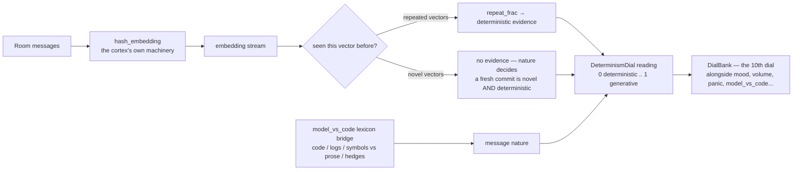

# SuperInstance Exocortex — Core Prototype

The **exocortex** is an external brain that wraps around any small local model.
The local model stays frozen; the brain around it grows through compiled
reflexes, semantic memory, cloud-teacher distillation, cognitive routing, bond
gating, and voice as the first cascade gate.

> The model is small; the brain outside it is not.

## Modules

| Module | Responsibility |
|--------|----------------|
| `reflex_cache` | `.nail` reflex cache with exact-hash and vector-nearest-neighbour lookup, asymmetric confidence updates, and an escape-hatch counter. |
| `voice_gate` | STT pattern matching against a pre-approved trigger table; exact/substring matching, urgency detection, and cascade routing. |
| `memory` | Pluggable semantic-memory index (sqlite-vec when available, in-memory fallback), hash embeddings, upsert/query/delete, and outcome write-back. |
| `router` | `batten-spline` cascade router mapping embeddings to `REFLEX`, `LOCAL`, or `CLOUD` targets; outcome feedback reshapes the spline. |
| `bond` | Lucineer bond scoring, tier thresholds, and a `BondGate` that unlocks autonomous actions as trust accumulates. |
| `distiller` | Teacher → student → compile loop: cloud teacher produces a lesson, local student evaluates it, and positive deltas become `.nail` reflexes. |
| `determinism_dial` | The 10th dial: the cortex reads a room's determinism with its own embedding machinery (hash-embedding repetition + the `model_vs_code` lexicon bridge), `[0 deterministic .. 1 generative]`. Registers into the elephant's `DialBank`. |

## The cortex feels how deterministic it's being

> Cross-pollinated from the elephant's signal-chain thesis: a room's signal
> is not only *what* is said, but *who or what* is generating it. The cortex
> answers with its own eyes — the hash-embedding stream.

`DeterminismDial` is the cortex's 10th sense. It reads a room with the
cortex's own machinery: every message is hash-embedded, and the dial asks
*have I seen this vector before?* A room that repeats itself is
deterministic; a room that always says something new is generative. The
`model_vs_code` lexicons are bridged in as the room's *nature*, and
repetition dampens it:

```
reading = nature * (1 - repeat_frac)
```



```python
from exocortex import DeterminismDial, register_determinism_dial

dial = DeterminismDial()
print(dial.read(room))            # 0.0 deterministic .. 1.0 generative
print(dial.embedding_stats(room)) # repeat_frac, novel_frac, stream_entropy...

# The elephant seam: if the elephant is importable (ELEPHANT_ROOT or a
# ../elephant sibling), the dial subclasses its real Dial ABC and drops
# straight into a DialBank.
from elephant.dial import DialBank
register_determinism_dial(DialBank())
```

<p align="center">
  
</p>

See [`docs/determinism-dial.md`](docs/determinism-dial.md) for the full
writeup: the two senses (lexicon bridge + embedding statistic), the
reading table, and the elephant seam.

## Quick start

```python
from exocortex import ReflexCache, ExoRouter, MemoryIndex

cache = ReflexCache()
cache.store("what is 2+2", "4", confidence=0.9)
print(cache.lookup("what is 2+2").response)  # 4

router = ExoRouter()
# Before learning, unknown embeddings route to CLOUD.
print(router.route([0.1] * 384).target)

memory = MemoryIndex()
memory.upsert("doc1", "The exocortex writes every outcome back to memory.")
print(memory.query("outcome memory", k=1)[0][1])  # similarity score
```

## Installation

```bash
python3 -m venv .venv
source .venv/bin/activate
pip install -e ".[dev]"
pytest
```

## License

MIT — see `LICENSE`.
